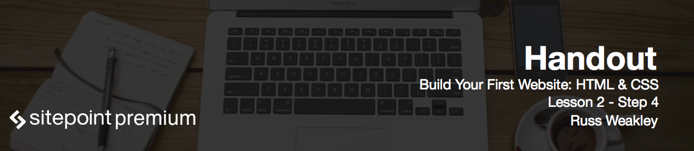

# Setting up base styles for HTML elements

To prepare for this step download the provided files, navigate to the *assets/css* and open *base.css* file.

First of all, define basic styling rules. Our first selectors are the `html` and `body`. Set the color to `#777` which is a deep gray, and the background to `#fff`, which is white:

```css
html,
body
{
	color: #777;
	background: #fff;
}
```

Next we'll style the `body` element on its own:

```css
body
{
	margin: 0;
	padding: 0;
	font-size: 1em;
	font-family: helvetica, arial, sans-serif;
	line-height: 1.3;
}
```

Next up, let's style our headings:

```css
h1,
h2,
h3,
h4,
h5,
h6
{
	margin: 0;
	color: #424242;
	line-height: 1.1;
}
```

Now the `img` element:

```css
img
{
	max-width: 100%;
	height: auto;
	border: 0;
	vertical-align: middle;
}
```

`max-width: 100%` means that we have fluid images now: their width can be smaller than 100% if the layout dictates, but they will never go wider than their natural size. The `height` is set to `auto` so we don't get them distorted. `border` is set to `0` so we don't get blue borders around them in older versions of Internet Explorer. And the `vertical-align` is set to `middle` so it will sit in the middle of lines, and you won't get these weird gaps below them sometimes.

Next style the `img` element when it's inside an `a`:

```css
a:focus img { background: #000; }
a:hover img { background: #3bb2d0; }
a:active img { background: #af0000; }
```

Next is the `blockquote`:

```css
blockquote { margin: 0; }
```

Block quotes often have a margin on the left side, and this rule will just make sure the margin is gone.

# Setting up base styles for different viewports

We're going to write our first media query now. I want to increase the base font size, which is applied to the `body` element, but only when the window gets wider than a certain value:

```css
@media (min-width: 38em)
{
	body
	{
		font-size: 1.125em;
	}
}
```

`1.125em` will be equal to `18px` whereas `1em` equals `16px`.