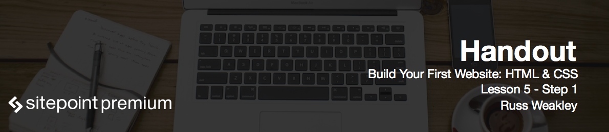

# Planning the contents and styles for banner module

In this lesson we will style the banner module. If you look at the finished layout, you'll see that the banner takes up a large area of the main screen. We're going to be working in three different components of this module:

* Overall banner module
* Header area, which includes the logo and the nav
* Banner content area.

The banner itself has a large and a small version of the image, so our first task is to style the banner and to make sure that we can swap out the image.

# Creating HTML elements for banner image area

Open up *index.html* and replace banner's code with the following:

```html
<div class="row row--banner">
  <header class="row container-wide header" role="banner">
    <div class="header__logo">
      
    </div>
    <nav class="header__nav" role="navigation">
      <ul>
        <li class="header__nav-about"><a href="#">About</a></li>
        <li class="header__nav-contact current"><a href="#">Contact</a></li>
      </ul>
    </nav>
  </header>
  <section class="row container-medium banner-content">
    <h1 class="banner-content__heading">
      A smarter expense tracker
    </h1>
    <a href="#"></a>
  </section>
</div>
```

As you see, we've added a role of `banner` to the `header` - that's the area landmark role. `nav` also has a role of `navigation`. Notice that inside the `nav` one of the `li`s has a class of `current` - that is because of them will be selected.

# Styling the banner image area

Open up the *modules.css* file and paste the following code:

```css
.row--banner
{
  background-color: #626e6d;
  background-image: url(../img/banner-small.jpg);
  background-repeat: no-repeat;
  background-position: center;
  background-size: cover;
}
@media (min-width: 38em)
{
  .row--banner { background-image: url(../img/banner.jpg); }
}
```