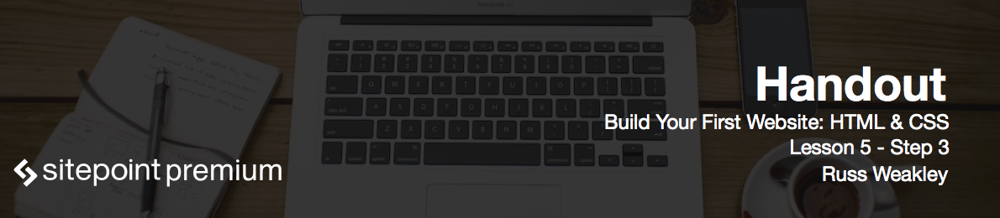

# Styling the banner content area

Now we need to get a bit of spacing in the banner's content area and style the text to be much larger. Open up *modules.css* and paste the following code:

```css
.banner-content
{
  padding: 1.875em 1.5em 2.8125em;
  /* 30px/16px - 24px/16px - 45px/16px */
  text-align: center;
}
.banner-content__heading
{
  margin: 0 0 1.875em;
  /* 30px/16px */
  color: #fff;
  font-size: 1.5em;
  /* 24px/16px */
  font-weight: normal;
}
```

Now let's add styling for wide screen versions.

# Creating banner content styles for wide screens

Add the following code to *modules.css*:

```css
@media (min-width: 38em)
{
  .banner-content
  {
    padding: 7.5em 2em;
    /* 135px/18px - 36px/18px */
  }
  .banner-content__heading
  {
    font-size: 2.5556em;
    /* 46px/18px */
  }
}
```

Now the reload the page and try to resize window. You'll notice that at a certain point the text becomes much smaller and the banner image is changing from large a small one. Our banner is finished!