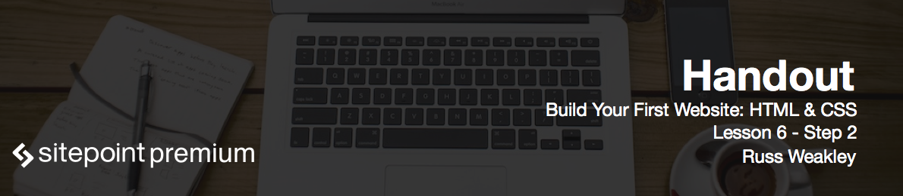
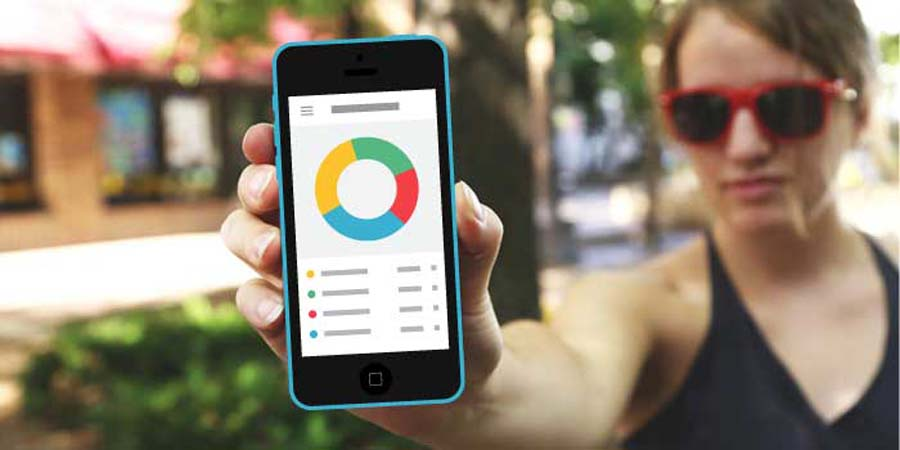

# Planning content for photos area

The photos area is the simplest one. We're going to just dump in two images inside the two columns, both of them set to `col-medium`. On small screens it will drop down to vertical layout whereas on wide display it will become a horizontal layout.

# Creating HTML elements and styling photos area

Open up *index.html* file and replace photos area with the following code:

```html
<div class="row">
  <div class="col-medium">
    
  </div>
  <div class="col-medium">
    
  </div>
</div>
```

As you see, we've used `alt` attribute for both images. Keep in mind that `alt` is used for a range of different purposes. It provides an alternative text to the image, if someone's using a screen reader, or has images turned off, or cannot access the images for some reason.

We even don't need to style photos at all as they've already been controlled by the styles for rows and cols.