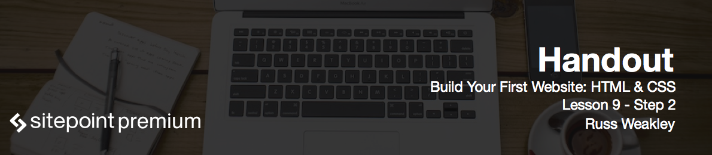

# Introduction to browser and device testing

**Browser testing** is a process of testing HTML and CSS layouts in a range of different browsers and devices to make sure the layout operates as expected. Ideally, you should check your layouts regularly during the build process, rather than right at the end, as this means you can find and resolve layout issues much more quickly and easily.

If you work on one particular platform, like Mac or Windows, how can you check your layouts in different operating systems and across different devices? It appears that there are a wide range of free and paid online services that you can use to check your layouts across different operating systems, different browsers, and different devices. There are online tools like **Browserstack**, **Browsershots**, **Netrenderer**, **SauceLabs**, **Browsera**, and **Browserling**. There are also a range of online responsive testing tools: **Matt Kersley's Responsive** tool, **Responsive.is** and **The Responsinator**.

I use a range of these different tools during testing but I also use **VMWare Fusion**. This allows me to run two full versions of Windows 7 (with IE 8 and 11) on my Mac. I also use XCode which allows me to emulate various Apples devices.

To do browser testing you may use the live demo version of the site at [http://buildyourfirst.website/html](http://buildyourfirst.website/html).

# Testing in various browsers and operating systems

I've opened the demo site in different Mac and Windows browsers and everything appeared to be working fine. As I mentioned before that while doing real projects you'd be testing quite heavily as you're building, not right at the very end. Otherwise you might come across some sort of major problem, and then you'd have to reverse engineer the page. So the sooner you can find a bug, the easier it is to resolve.

# Testing in various devices using simulation tools

I've also used XCode to run iOS simulator and test the site - the result was successful.

And this brings us to the end of the course. I hope you found it useful. Thanks very much for taking part, and I hope to see you online!